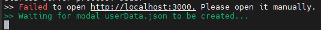
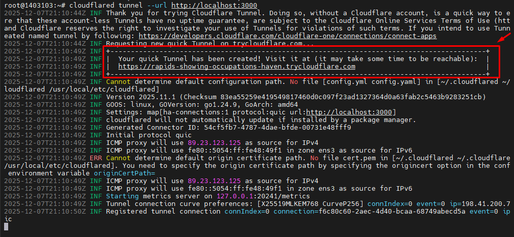
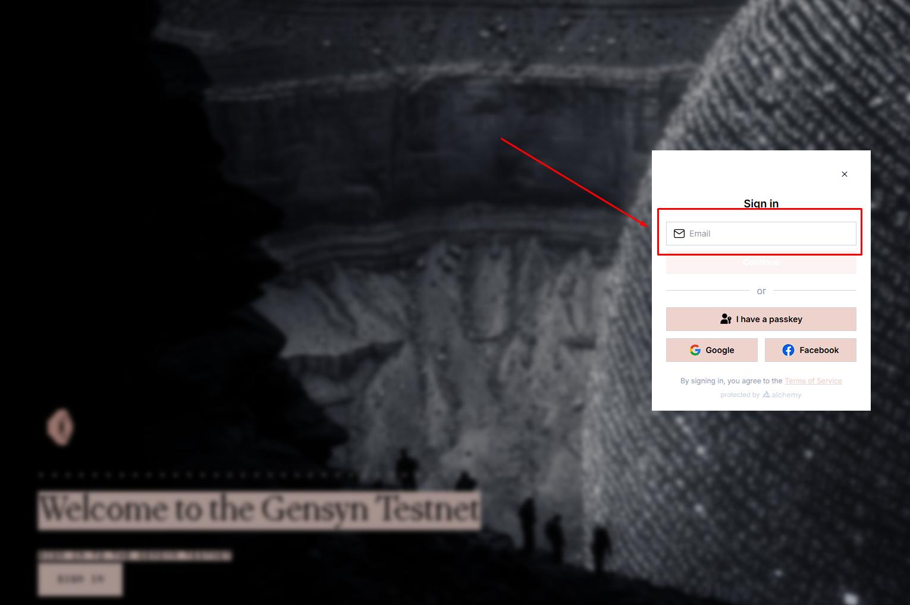
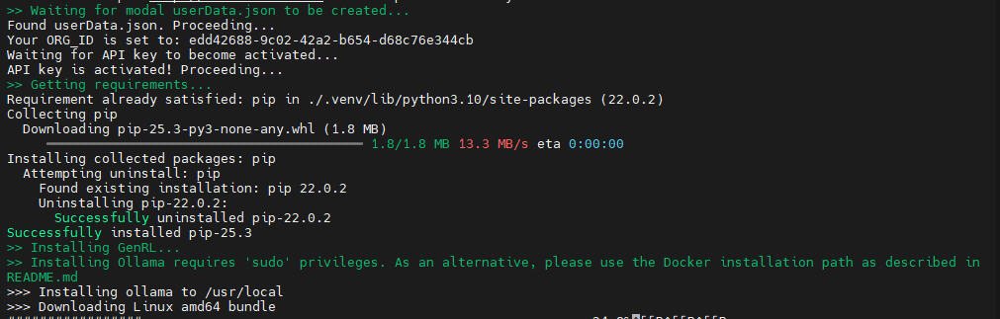
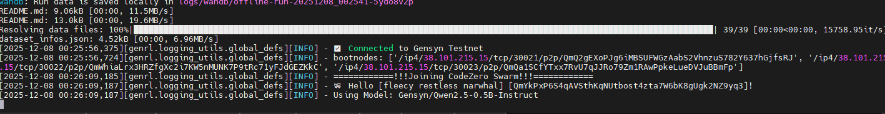

# Gensyn RL-Swarm Node VPS 

<div align="center">

**[English](rl-swarm(EN).md)** | **[Русский](rl-swarm(RU).md)**

</div>

---

## System Requirements

### Minimum Requirements
- **OS:** Ubuntu 22.04 LTS / Ubuntu 20.04 LTS
- **RAM:** 16GB (32GB recommended)
- **CPU:** 4 cores (8+ recommended)
- **Storage:** 50GB free space (NVMe SSD preferred)
- **Network:** Stable connection, minimum 100 Mbps
---

## VPS rental

- [Xorek Cloud](https://xorek.cloud/ru)
- [Space Core](https://spacecore.pro/ru/)

---

## Quick Installation 

### One-Command Installation
```bash
sudo apt update && sudo apt install -y python3 python3-venv python3-pip curl wget screen git lsof build-essential gcc g++ && git clone https://github.com/gensyn-ai/rl-swarm.git && cd rl-swarm && python3 -m venv .venv && source .venv/bin/activate && sed -i -E 's/(num_train_samples:\s*)2/\1 1/' code_gen_exp/config/code-gen-swarm.yaml && screen -S gensyn && ./run_rl_swarm.sh
```

---

### Setup Login Tunnel

Open a **new SSH session** and run:
```bash
wget -q https://github.com/cloudflare/cloudflared/releases/latest/download/cloudflared-linux-amd64.deb && sudo dpkg -i cloudflared-linux-amd64.deb && cloudflared tunnel --url http://localhost:3000
```

Copy the generated URL, open it in your browser, and complete the login.

---

**After the download completes, you will see the following:**

1. Push to Hugging Face Hub? → Type `N` and press Enter
2. Model name? → Type `Gensyn/Qwen2.5-0.5B-Instruct` and press Enter
3. Prediction Market? → Type `n` and press Enter

**Detach from screen:** `Ctrl+A` + `D`

---

## Step-by-Step Guide

### Step 1. Install Packages and Dependencies
```bash
sudo apt update && sudo apt upgrade -y
```
```bash
sudo apt install -y python3 python3-venv python3-pip curl wget screen git lsof nano unzip build-essential gcc g++
```

**Verify installation**
```bash
python3 --version  
git --version
screen --version
```

---

### Step 2. Clone Repository
```bash
cd ~
git clone https://github.com/gensyn-ai/rl-swarm.git
cd rl-swarm
```

---

### Step 3. Create Virtual Environment
```bash
python3 -m venv .venv
source .venv/bin/activate
```

---

### Step 4. Configure Training Parameters
```bash
sed -i -E 's/(num_train_samples:\s*)2/\1 1/' code_gen_exp/config/code-gen-swarm.yaml
```
```bash
grep "num_train_samples" code_gen_exp/config/code-gen-swarm.yaml
```

**Why this matters:** Using `train_samples: 1` reduces RAM usage from 12-15GB to 8-10GB and significantly reduces the probability of node crashes.

---

### Step 5. Launch the Node

**Start in screen session:**
```bash
screen -S gensyn
```

**Run the node:**
```bash
./run_rl_swarm.sh
```

**Wait for the following result:**



**Important:** Without closing the first SSH session, open a new one:
```bash
ssh root@YOUR_VPS_IP
```

---

## Tunnel Setup

### Step 1. Install Cloudflared

**Install cloudflared**
```bash
wget -q https://github.com/cloudflare/cloudflared/releases/latest/download/cloudflared-linux-amd64.deb
sudo dpkg -i cloudflared-linux-amd64.deb
```

**Verify installation**
```bash
cloudflared --version
```

---

### Step 2. Create Tunnel
```bash
cloudflared tunnel --url http://localhost:3000
```

After this command, you will see a link in a dotted frame:



---

### Step 3. Complete Login in Browser

1. Open the received link in your browser
2. Click **"Sign in with Gmail"** (NOT "Connect with Google")



3. Enter your email address
4. Check your email for the verification code
5. Enter the code on the login page
6. Click Submit

After you successfully log in, the installation will continue in the first session:



**After successful installation, you will be prompted with questions:**

- `Would you like to push models to Hugging Face Hub? [y/N]` → `N`
- `Enter the name of the model` → `Gensyn/Qwen2.5-0.5B-Instruct`
- `Prediction Market? [y/N]` → `n`

---

## Alternative Tunnel Options

### Option A - SSH Local Port Forwarding

On your local PC:
```bash
ssh -L 3000:localhost:3000 root@YOUR_VPS_IP
```

Then open in browser: `http://localhost:3000`

Keep this terminal open during login.

---

### Option B - localhost.run
```bash
ssh -o StrictHostKeyChecking=no -R 80:localhost:3000 nokey@localhost.run
```

---

### Option C - serveo
```bash
ssh -R 80:localhost:3000 serveo.net
```

---

## Verify Successful Installation

**Check that files were created:**
```bash
ls -la ~/rl-swarm/userData.json
ls -la ~/rl-swarm/swarm.pem
```

**Important** Save these files somewhere safe on your PC

After these steps, you can close the tunnel terminal (Ctrl+C)

---

**Check node logs**
```bash
screen -r gensyn
```



**Congrats, you have run the node**

**Detach:** `Ctrl+A` + `D`

---

## Getting Swarm Discord Role

### Prerequisites

- Node running continuously for 24+ hours
- Peer ID registered on blockchain
- Same email used for login, dashboard, and Discord

---

### Step 1. Install Go
```bash
sudo rm -rf /usr/local/go
curl -L https://go.dev/dl/go1.22.4.linux-amd64.tar.gz | sudo tar -xzf - -C /usr/local
```

**Add to PATH:**
```bash
echo 'export PATH=$PATH:/usr/local/go/bin:$HOME/go/bin' >> $HOME/.bash_profile
source $HOME/.bash_profile
```

**Verify installation**
```bash
go version
```

---

### Step 2. Install gswarm
```bash
go install github.com/Deep-Commit/gswarm/cmd/gswarm@latest
```

**Verify installation**
```bash
gswarm --version
```

---

### Step 3. Create Telegram Bot

**Open Telegram and find [@BotFather](https://t.me/BotFather):**

1. Send `/newbot`
2. Choose a name for your bot (e.g., "My Gensyn Bot")
3. Choose a username (must end in "bot", e.g., "mygensyn_bot")
4. Copy and save the provided bot token

---

### Step 4. Get Your Telegram Chat ID

**Find [@userinfobot](https://t.me/userinfobot) in Telegram:**

1. Start a conversation
2. Send `/start`
3. Copy your Chat ID

---

### Step 5. Get Your EOA Address

1. Go to [Gensyn Dashboard](https://dashboard.gensyn.ai)
2. Log in with the same email you used for node login
3. Copy your EOA address (starts with 0x...)

---

### Step 6. Run gswarm
```bash
gswarm
```

**Enter when prompted:**

- Bot Token: Paste your bot token from BotFather
- Chat ID: Paste your Chat ID from userinfobot  
- EOA Address: Paste your EOA from dashboard

**If you see error "No peer IDs found":**

- Wait 1-2 hours (node needs time to register on blockchain)
- Check logs: `grep "is already registered" ~/rl-swarm/logs/swarm_launcher.log`
- If you see your Peer ID registered, try gswarm again

---

### Step 7. Connect Discord and Telegram

**In Discord:**

1. Go to Gensyn server, channel `#swarm-link`
2. Type: `/link-telegram`
3. Copy the provided verification code

**In Telegram:**

1. Open your bot (the one you created)
2. Send: `/verify YOUR_CODE_HERE`
3. Wait for confirmation

**Voilà! You should now have the Swarm role**

---

## Official Links

- [Official Gensyn Website](https://www.gensyn.ai)
- [Dashboard](https://dashboard.gensyn.ai)
- [GitHub](https://github.com/gensyn-ai/rl-swarm)
- [Discord](https://discord.gg/gensyn)
- [Documentation](https://docs.gensyn.ai)
